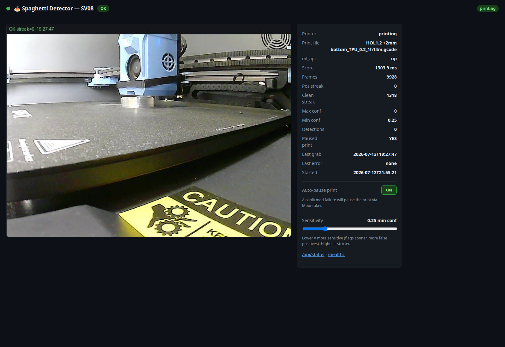

# 🍝 SpaghettiGuard

> **⚠️ WORK IN PROGRESS — NOT PRODUCTION READY ⚠️**
> Bed-clear calibration (Z/time-slot reference build) is under active development.

> Self-hosted, no-cloud, free 3D-print spaghetti/failure detector — Obico ml_api (CPU) + webcam poller + live dashboard. Notify-only or optional Moonraker auto-pause.

<p align="center">
  
</p>


**Self-hosted, no-cloud, free print-failure ("spaghetti") detector for Klipper 3D printers.**

SpaghettiGuard watches your printer's webcam, runs a pretrained failure-detection model
on each frame, and raises a debounced alert when a print starts turning into spaghetti.
A small dashboard shows the live annotated camera feed and detector status. Everything
runs on your own hardware — no accounts, no subscriptions, no images leaving your network.


*Live detection: red `failure` boxes over a tangled print; the toolhead and bed are ignored.*

---

## How it works

```
Printer webcam (mjpg-streamer)
      │  snapshot every few seconds
      ▼
Obico ml_api  ──►  pretrained ONNX "failure" model (CPU)   [Docker container]
      │  detections: [[label, confidence, [cx,cy,w,h]], ...]
      ▼
SpaghettiGuard app  ──►  debounce ──► draw boxes ──► dashboard :8110
      │
      └──► on confirmed failure: log · Moonraker pause (on by default) · optional email
```

Inference is done by the open-source [Obico](https://github.com/TheSpaghettiDetective/obico-server)
`ml_api` model — the same failure detector used by The Spaghetti Detective — packaged as a
small CPU-only Docker container. SpaghettiGuard is the thin, dependency-light layer that polls
the camera, debounces detections into stable alerts, and gives you a dashboard and actions.

## Features

- **100% self-hosted & free** — no cloud, no API keys, no telemetry.
- **CPU-only** — no GPU required; ~150–250 ms per frame on a typical CPU.
- **Debounced alerts** — needs N consecutive positive frames to alert, and M clean frames
  to clear, so a single noisy frame won't cry wolf.
- **Stops the bleeding** — on a confirmed failure it pauses the print via Moonraker.
  On by default; flip it to notify-only whenever you like.
- **Live auto-pause toggle** — switch it on/off from the dashboard (or `POST /api/auto_pause`)
  without restarting the service or editing `.env`.
- **Optional email** — get mailed when a failure is confirmed.
- **Tiny dashboard** — live annotated feed, detector health, `/api/status` JSON, `/healthz`.

## Requirements

- A 3D printer running **Klipper + Moonraker** with a webcam exposing an MJPEG **snapshot URL**
  (e.g. `mjpg-streamer`, common on Mainsail/Fluidd setups).
- **Docker** (to run the inference container).
- **Python 3.8+** (to run the app; only dependency is Pillow).

> **Where to run it:** the app itself is tiny (Pillow + stdlib), but the Obico
> `ml_api` inference container is CPU- and RAM-hungry (≈1 GB image, hundreds of MB
> resident, ONNX scoring every few seconds). Run SpaghettiGuard on a **separate
> always-on machine**, not on the printer's own SBC (e.g. a 1 GB Pi/CB1 already
> running Klipper). On such a host the inference would contend with Klipper's
> realtime loop — risking print stutter — and can exhaust RAM. Point `SNAPSHOT_URL`
> and `MOONRAKER_URL` at the printer over the LAN instead. Only the lightweight
> **bed-clear** check (Pillow-only, no ml_api) is cheap enough to co-locate on the
> printer host if you ever split the two.

## Install

```bash
git clone https://github.com/youforge-max/SpaghettiGuard.git
cd SpaghettiGuard

# 1) Build + run the Obico ml_api inference container (CPU)
git clone --depth 1 https://github.com/TheSpaghettiDetective/obico-server.git
docker build -f obico-server/ml_api/Containerfile.cpu -t obico-ml-cpu obico-server/ml_api
docker run -d --name obico-ml -p 3333:3333 --restart unless-stopped obico-ml-cpu

# 2) Set up the app
python3 -m venv venv && ./venv/bin/pip install -r requirements.txt
cp .env.example .env          # then edit SNAPSHOT_URL to your printer's webcam
./venv/bin/python app.py

# open http://localhost:8110
```

Find your snapshot URL in your printer's webcam settings — it usually looks like
`http://<printer-ip>/webcam/?action=snapshot`.

## Configuration (`.env`)

| Key | Default | Description |
|-----|---------|-------------|
| `SNAPSHOT_URL` | — | Printer webcam MJPEG snapshot URL (**set this**) |
| `ML_API_URL` | `http://127.0.0.1:3333` | Obico ml_api endpoint |
| `ML_API_TOKEN` | *(blank)* | Only if you set a token on the container |
| `PORT` | `8110` | Dashboard port |
| `CONF` | `0.25` | Min confidence for a frame to count as a positive |
| `POLL_SEC` | `6` | Seconds between webcam grabs |
| `ALERT_STREAK` | `3` | Consecutive positive frames before ALERT |
| `CLEAR_STREAK` | `5` | Consecutive clean frames to clear an alert |
| `AUTO_PAUSE` | `1` | Pause the print via Moonraker on alert. `0` = notify-only. **Starting value only** — toggleable at runtime |
| `MOONRAKER_URL` | — | Moonraker base URL (**set this** if auto-pause is on) |
| `SMTP_*`, `ALERT_EMAIL_TO` | *(blank)* | Optional email alerts |

> **Note:** systemd's `EnvironmentFile` does not strip inline `# comments` — keep values on
> their own line in `.env`.

## Alerting

Debounce: `ALERT_STREAK` positive frames → **ALERT**; `CLEAR_STREAK` clean frames → clear.

On a confirmed failure SpaghettiGuard sends Moonraker `printer/print/pause`, and emails you
if the `SMTP_*` block is filled in.

### Auto-pause

Auto-pause is **on by default**, so a false positive can pause a healthy print. That is the
intended trade — a paused print is recoverable, a bed full of spaghetti is not. If you'd
rather watch it prove itself first, start in notify-only mode with `AUTO_PAUSE=0`.

`AUTO_PAUSE` only sets the value the app *starts* with. After that it's a live toggle:

- **Dashboard** — the *Auto-pause print* button in the status panel.
- **API** — `POST /api/auto_pause` with `{"enabled": true|false}`.

```bash
curl -X POST http://localhost:8110/api/auto_pause \
     -H 'Content-Type: application/json' -d '{"enabled": false}'
# -> {"auto_pause": false}
```

The current value is always in `/api/status` as `auto_pause`. It is **not** persisted —
a restart goes back to whatever `AUTO_PAUSE` says in `.env`.

> Auto-pause needs `MOONRAKER_URL` pointing at your printer. If it's wrong, the pause
> request fails and is logged as an error — the alert itself still fires.

## Run as a service (optional)

A `spaghetti-detector.service` unit is included. Edit the paths/user to match your system,
then:

```bash
sudo cp spaghetti-detector.service /etc/systemd/system/
sudo systemctl enable --now spaghetti-detector
```

## Endpoints

| Method | Path | Purpose |
|--------|------|---------|
| `GET` | `/` | Dashboard |
| `GET` | `/snapshot.jpg` | Latest annotated frame |
| `GET` | `/api/status` | Detector status (JSON), including `auto_pause` |
| `GET` | `/healthz` | Health check |
| `POST` | `/api/auto_pause` | Toggle auto-pause — body `{"enabled": true\|false}` |

There is no authentication. Keep it on your LAN, behind a reverse proxy, or firewalled —
anything that can reach the port can toggle auto-pause.

## Tuning

Start with the defaults. If you get false positives, raise `CONF` or `ALERT_STREAK`.
If it misses failures, lower them.

Detection quality is mostly about the camera: a stable mount, even lighting, and a view
that actually frames the part will do more than any threshold. Lighting that changes through
the print (a window at dusk) is the usual source of false positives.

If you're not yet convinced it can tell spaghetti from your prints, run with `AUTO_PAUSE=0`
for a few jobs and watch the alerts, then turn it on.

## Bed-clear calibration (work in progress)

The ML model ignores the bed, so a finished part looks the same as an empty bed. A
separate **reference-diff** check answers "is the bed clear?" — it compares the live
frame against a stored photo of the *empty* bed and flags any change. Useful as a
crash guard before the next job.

Two things move the empty-bed image on this rig (a low, grazing webcam next to a
window), so a single reference is not enough:

- **Z height** — the grazing cam sees the nozzle at a different apparent height per Z.
- **Time of day** — daylight shifts the *shadows*, not just brightness, and moves fast
  at dawn/dusk.

So references are indexed by **(15-min time slot, Z)**: `bed_ref_z/qNN/zNNN.png`, 96
slots/day. Each frame the detector picks the reference nearest the current toolhead Z
within the slot nearest the current wall clock (cyclic).

**Building the references** — press **Capture bed reference** on the dashboard
(bed must be EMPTY). One sweep runs per press and captures the **current** 15-min
slot. There is **no schedule and no cron**: the head moves *only* while a sweep you
started is running, and stops when it ends. To cover the day, press again in
different slots; each press adds/refreshes that slot's stack. An **Abort sweep**
button stops a running sweep immediately (it sends `SIGINT`, so fans are restored
and the head halts cleanly). The Capture button is disabled while a sweep runs, so
it can't be double-fired.

Each sweep homes (`G28`), parks **back-left `X5 Y345`** — the SV08's post-print rest
pose, where bed-clear detection actually runs — then steps Z `5→300 mm` in 1 mm steps
(~8 min), capturing the empty bed at each height. During a sweep it silences the
**chamber exhaust + toolhead fans** (airflow/vibration disturbs the frame) and restores
them after; the **bottom host-cooling fan and hotend fan are left untouched** for
thermal safety. The head **moves** — never start it during a print (the sweep refuses
if one is running).

Bias is intentionally toward **false positives**: a spurious "object" is cheap, a
toolhead crashing into a missed part is not.

### Standalone / scheduled check (`bed_check.py`)

Besides the live dashboard, bed-clear detection also works as a one-shot CLI —
handy for a scheduled crash-guard between jobs:

```bash
python3 bed_check.py --capture-reference   # run once, bed actually empty
python3 bed_check.py --check               # prints CLEAR / OCCUPIED + match%
python3 bed_check.py --check --no-park      # skip the park (head already positioned)
```

Exit code: `0` = clear, `2` = occupied, `1` = error / no reference. Each `--check`
parks the head to the reference pose first and **refuses to run while a print is
active**, so it's safe to schedule. To poll periodically (e.g. an hourly bed-clear
sweep over a day) wrap it in a loop or a cron/systemd-timer entry that runs
`bed_check.py --check` on your interval and logs the verdict — the exit code drives
any alerting you bolt on. Keep the head parked at the same pose the reference was
captured at, or the toolhead itself reads as a false "occupied".

> Still under active development — thresholds and the reference set are being tuned.

## What it is not

SpaghettiGuard's ML model detects **spaghetti and print failures** only. On its own it
does not tell you whether the bed is clear, whether the right part is on it, or whether
a print finished cleanly — a finished part produces no detections, exactly like an empty
bed. The bed-clear check above is a separate reference-diff layer, not the ML model.
Don't use "no detections" as proof that anything is present or absent.

## Credits

- Failure-detection model & `ml_api`: [Obico / The Spaghetti Detective](https://github.com/TheSpaghettiDetective/obico-server) (AGPL).
- SpaghettiGuard app: MIT (see [LICENSE](LICENSE)).

> This project is not affiliated with or endorsed by Obico. It simply runs their
> open-source model container locally.
